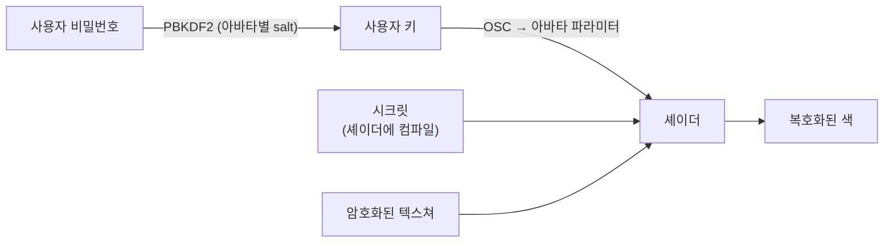

# ShellProtector 동작 원리

[README](./README.md)로 돌아가기

ShellProtector는 빌드할 때 텍스쳐를 CPU에서 암호화하고, 게임 안에서는 셰이더가 픽셀마다 복호화합니다. 이 문서는 키를 어떻게 만들고 전달하는지, 텍스쳐를 어떤 구조로 암호화하는지, 셰이더 비용을 어떻게 줄였는지를 설명합니다.

## 목차

- [전체 흐름](#전체-흐름)
- [키](#키)
- [사용자 키와 OSC](#사용자-키와-osc)
- [셰이더 시크릿](#셰이더-시크릿)
- [텍스쳐 암호화](#텍스쳐-암호화)
- [Emission 암호화](#emission-암호화)
- [셰이더 주입](#셰이더-주입)
- [빌드 파이프라인](#빌드-파이프라인)
- [GPU 비용을 줄이기 위한 설계](#gpu-비용을-줄이기-위한-설계)
- [검증](#검증)

## 전체 흐름



## 키

암호화 키는 16바이트이며, 전부 사용자 비밀번호에서 만든 사용자 키입니다. 머티리얼에는 키가 저장되지 않습니다.

셰이더는 이 16바이트를 32비트 워드 4개로 씁니다. 마지막 워드에는 암호화 단위의 번호와 밉 레벨을 XOR해서, 단위마다 그리고 밉 레벨마다 다른 키스트림이 나오게 합니다.

## 사용자 키와 OSC

사용자 키는 비밀번호에서 다음과 같이 만듭니다.

```
derived  = PBKDF2-HMAC-SHA256(비밀번호, salt, 600,000회, 32바이트)
사용자 키 = derived[0, 16)
```

- **salt**는 컴포넌트마다 한 번 만드는 16바이트 난수입니다. 아바타에 로컬 전용 파라미터 `SP_SALT_<salt>`로 노출되고, OSC 프로그램은 VRChat의 아바타별 OSC 설정 파일에서 이 값을 찾습니다. 비밀번호가 같아도 아바타마다 키가 다릅니다.
- **파라미터 이름**도 `derived`의 나머지 16바이트를 키로 한 HMAC-SHA256으로 만듭니다. 키를 전달하는 파라미터의 이름이 아바타마다 다르고, 이름만 봐서는 역할을 알 수 없습니다.
- OSC 프로그램(C++)과 이 패키지(C#)는 같은 known-answer 테스트로 서로 같은 값을 만드는지 확인합니다.

OSC 프로그램은 사용자 키를 1바이트씩 float 파라미터로 보내고, 애니메이터가 그 값을 머티리얼의 `_Key0`..`_Key15`로 옮깁니다. 동기화 속도에 따라 방식이 다릅니다.

- **속도 1**: OSC 프로그램이 동기화 파라미터 하나를 직접 돌려 가며(멀티플렉싱) 키를 보냅니다. 파라미터를 가장 적게 쓰지만 OSC 프로그램이 계속 켜져 있어야 합니다.
- **속도 2, 4**: OSC 프로그램은 키를 저장되는 로컬 파라미터에 한 번 써 둡니다. 이후에는 아바타의 애니메이터 레이어가 그 값을 2개 또는 4개씩 돌려 가며 동기화하므로 OSC 프로그램을 끄고 VRChat을 다시 켜도 키가 남아 있습니다.

## 셰이더 시크릿

사용자 키 외에, 생성된 셰이더 안에만 들어 있는 값이 있습니다.

- 16바이트 키 마스크. 셰이더가 키 워드에 XOR합니다.
- ChaCha 상수 4워드. 표준 상수 대신 무작위 값을 씁니다.

이 값들은 머티리얼에 저장하지 않고 `#define`으로 셰이더에 컴파일해 넣습니다. 머티리얼 속성만 뽑아서는 키를 완성할 수 없고, 셰이더 바이너리까지 분석해야 합니다.

- Poiyomi: 셰이더 복사본마다 그 머티리얼의 메인 텍스쳐에 대응하는 시크릿을 넣습니다. 여러 머티리얼이 같은 텍스쳐를 쓰면 텍스쳐는 한 번만 암호화합니다.
- lilToon: 프로젝트 전체가 하나의 시크릿을 씁니다.

## 텍스쳐 암호화

암호는 ChaCha를 6라운드, 128비트 키로 씁니다. 128비트 키를 키 행 두 곳에 채우고, 카운터는 1부터, nonce는 머티리얼 속성 3워드입니다. C# 구현과 셰이더 구현은 같은 키스트림을 만들어야 하며, 테스트로 이를 확인합니다.

### RGB24 / RGBA32

4x4 픽셀 블록 하나가 64바이트 키스트림 블록 하나에 대응하고, 픽셀 하나에 워드 하나를 씁니다. 셰이더는 블록마다 한 번 키스트림을 만들면 블록 안의 16픽셀을 모두 복호화할 수 있습니다.

### DXT1 / DXT5

DXT 블록에서 색을 결정하는 끝점(endpoint)만 암호화합니다.

1. 끝점을 DXT 블록당 1텍셀인 별도 RGBA32 텍스쳐로 옮기고, 이 텍스쳐를 위의 RGBA32 방식으로 암호화합니다. 키스트림 블록 하나가 DXT 블록 4x4개(16x16 텍셀)를 덮습니다.
2. 원래 DXT 텍스쳐에는 인덱스 비트만 남기고 끝점을 고정값으로 바꿉니다. 이 텍스쳐를 샘플링하면 블록 안 보간 가중치가 나옵니다.
3. 셰이더는 끝점 텍셀을 복호화한 뒤 가중치로 색을 다시 만듭니다.

압축 형식을 유지하므로 메모리는 2K DXT1 기준 약 1MB만 늘어납니다. 대신 인덱스 비트가 남아 있어 텍스쳐의 윤곽은 어느 정도 보입니다.

### BC7

BC7 블록은 모드가 8가지이고 블록 안을 최대 3개 영역(subset)으로 나눕니다. 그래서 DXT처럼 하드웨어 샘플링으로 보간 가중치를 얻을 수 없고, 셰이더가 블록을 직접 디코드합니다. 이를 위해 블록을 두 부분으로 나눕니다.

1. **픽셀 코드** (평문): 픽셀마다 6비트(영역 번호와 보간 인덱스)를 원본과 같은 크기와 밉 체인의 R8 텍스쳐에 담습니다. DXT의 인덱스 비트처럼 윤곽은 보이지만 색은 없습니다.
2. **끝점 레코드** (암호화): 블록마다 16바이트에 모드, 회전, 셀렉터(6비트)와 끝점을 원래 정밀도(p비트 포함) 그대로 비트 단위로 채웁니다. 가장 큰 모드(3, 7)도 102비트라 16바이트에 들어갑니다. 모든 밉 레벨의 레코드를 RGBA32 아틀라스 하나에 이어 붙이고, 위치는 머티리얼의 `_ShellSourceTexelSize`와 `_ShellMipOffsets0..3`로 찾습니다.
3. 키스트림 블록 하나(16워드)를 BC7 블록 2x2개(8x8 텍셀)가 4워드씩 나눠 씁니다.
4. 셰이더는 픽셀 코드와 끝점 레코드를 읽어 끝점을 8비트로 늘린 뒤, BC7 규칙대로 보간합니다.

메모리는 블록당 32바이트(코드 16바이트 + 레코드 16바이트)로 BC7 원본의 2배입니다. BC7은 ChaCha로만 암호화할 수 있습니다.

### 오프셋

텍스쳐 크기와 밉 레벨에 따른 위치 계산은 `Protector.cginc`의 표와 머티리얼의 `_Woffset` / `_Hoffset`으로 합니다. 암호화 레이아웃이 바뀌면 포맷 버전을 올리고, 이전 포맷으로 만든 출력물은 다음 빌드에서 자동으로 지웁니다.

## Emission 암호화

선택한 Emission 맵도 메인 텍스쳐와 같은 키, 시크릿, nonce로 암호화합니다. 다만 키 워드 0에 `0x53450000 + 슬롯 번호`를 XOR해서 슬롯마다 키스트림을 분리합니다.

- RGB 계열은 RGBA32 사본을, DXT는 메인 텍스쳐와 같은 끝점 텍스쳐를 암호화합니다. BC7 Emission 맵은 지원하지 않습니다.
- 맵 크기, 형식, 최대 밉, 필터, 반복 설정은 슬롯별 머티리얼 속성으로 셰이더에 넘깁니다.
- 원래 Emission 맵 자리에는 검은 텍스쳐를 넣습니다. 비밀번호가 틀리면 발광하지 않습니다.
- 메인 텍스쳐를 메인과 같은 UV로 쓰는 슬롯은 암호화하지 않고 설정값(`Settings.x = 4`)만 씁니다. 메인 텍스쳐 복호화 함수가 결과를 `static` 변수 `_ShellMainColor`에 남기고, 이 슬롯은 그 값을 그대로 씁니다. 잠긴 상태에서는 메인 복호화가 돌지 않아 값이 0이므로 역시 발광하지 않습니다. UV가 같은지는 빌드할 때 머티리얼 값으로 판단합니다(`EmissionEncryption.ReusesMainTexture`).
- Poiyomi는 `_EmissionMap*` 샘플링 코드를 감싸고, lilToon은 `LIL_GET_EMITEX`를 바꿔 끼웁니다.

## 셰이더 주입

- **Poiyomi**: 잠긴(locked) 셰이더를 복사하고, 메인 텍스쳐와 Emission 샘플링 부분을 복호화 코드로 바꿉니다. 이미 만든 복사본은 시크릿이 같으면 재사용합니다.
- **lilToon**: 커스텀 셰이더를 프로젝트에 한 번 복사해 쓰고, 바뀐 파일만 다시 씁니다. 셰이더 컴파일은 프로젝트당 한 번입니다.

두 경우 모두 `Protector.cginc`와 `Emission.cginc`를 복사하지 않고 경로로 `#include`합니다. 패키지를 업데이트하면 이미 만든 셰이더도 다시 컴파일될 때 새 코드를 씁니다.

림라이트와 아웃라인처럼 메인 텍스쳐를 다시 샘플링하는 부분은 복호화된 메인 색을 쓰도록 바꿉니다. 그 밖의 슬롯에 메인 텍스쳐와 같은 텍스쳐가 있으면 원본이 새어 나가지 않도록 뺍니다.

## 빌드 파이프라인

진입점은 두 가지입니다.

- **수동**: 인스펙터의 암호화 버튼. 아바타를 복제한 뒤 복제본을 암호화하고, 확인용 Tester 컴포넌트를 붙입니다.
- **업로드**: NDMF 플러그인. 업로드용 사본을 그 자리에서 암호화합니다. 원본 씬은 바뀌지 않습니다.

머티리얼마다 다음 순서로 처리합니다.

1. 메인 텍스쳐를 형식에 맞게 암호화합니다.
2. 셰이더 복사본에 복호화 코드를 넣습니다. (재사용 가능하면 건너뜁니다)
3. 폴백 텍스쳐를 만듭니다.
4. 암호화된 머티리얼을 만들고 nonce, 오프셋, Emission 설정을 씁니다.

그 뒤 키 파라미터와 키 애니메이션을 아바타에 추가하고, 쉐이프키를 난독화합니다. 출력은 `Assets/ShellProtector/Generated/<아바타 이름>/`에 모이고, 어떤 셰이더를 이미 만들었는지는 같은 폴더의 `EncryptedHistory.asset`에 기록합니다.

## GPU 비용을 줄이기 위한 설계

복호화는 아바타가 화면에 그려지는 동안 픽셀마다 실행됩니다. 그래서 암호 강도보다 픽셀당 연산량과 워프 분기를 먼저 고려했습니다.

- **ChaCha 6라운드**: 8라운드에서 줄였습니다. 키는 동기화 파라미터로 보는 사람 모두에게 전달되므로, 이 용도에서 암호 자체를 깨는 것은 쉬운 공격 경로가 아닙니다. 6라운드에는 알려진 실용적 공격이 없고, 4\~5라운드는 판매되는 원본 텍스쳐를 알려진 평문으로 쓸 수 있어 위험하다고 봤습니다. 복호화 명령 수가 약 1/4 줄어, 암호화한 머티리얼의 비용이 13\~22% 줄었습니다.
- **블록 단위 복호화**: 3.0버전 전에는 ChaCha 블록 하나에서 나오는 키스트림 16워드 중 2~3워드만 썼습니다. 지금은 키스트림 블록 하나가 4x4 픽셀(DXT는 16x16 텍셀)을 덮고 픽셀마다 한 워드를 씁니다. Bilinear 필터링에서는 네 샘플이 속한 블록 중 서로 다른 블록만 복호화하므로 대부분의 픽셀은 복호화를 한 번만 하고, 샘플당 텍스쳐 읽기도 RGB24 16회 → 4회, RGBA32 8회 → 4회로 줄었습니다.
- **동적 인덱싱 제거**: 픽셀마다 다른 인덱스로 로컬 배열을 읽으면, AMD 드라이버는 이를 웨이브 안의 서로 다른 인덱스마다 도는 루프로 바꿉니다(RGA로 확인했을 때 Bilinear 샘플당 9회). 키스트림 워드를 상수 인덱스만 쓰는 선택 연산으로 고르도록 바꿨습니다.
- **BC7 레코드 분리**: 처음 구현은 블록마다 32바이트 레코드 전체를 암호화하고 블록마다 키스트림을 하나씩 썼습니다. 키스트림 16워드 중 8워드만 쓰고, Bilinear 샘플이 4텍셀마다 다른 블록으로 넘어가 대부분의 워프가 키스트림을 네 번 만들었으며, 레코드 하나를 읽는 데 텍스쳐 읽기가 8회 필요했습니다. 픽셀 코드를 평문으로 분리하고 끝점을 원래 정밀도로 줄여 레코드를 16바이트로 만들자, 키스트림 하나를 2x2 블록이 나눠 쓸 수 있게 됐습니다. 여기에 샘플마다 디코드를 한 번만 하고 끝점을 32비트 창 하나로 읽도록 바꿔, 블록 경계를 넘을 때마다 드는 비용이 DXBC 기준 609\~749 → 368 명령으로 줄었습니다. 암호화한 BC7 머티리얼의 추가 비용은 4K 전체 화면 기준 +11.0ms → +7.4ms, 얼굴 근접 기준 +1.83ms → +1.12ms로 줄었고, 메모리는 같습니다. 그래도 탭마다 디코드해야 해서 DXT보다 약 2배 무겁습니다.

Emission 복호화를 추가한 뒤 프로파일링해서 다음을 고쳤습니다.

- HLSL의 삼항 연산자(`?:`)는 양쪽을 모두 실행합니다. 이 때문에 Emission 암호화를 끈 Poiyomi 머티리얼도 Emission을 복호화하고 있었습니다. 분기로 바꾸자, 모든 머티리얼을 암호화한 조건에서 프레임당 1.32ms → 0.91ms(전신), 3.26ms → 2.21ms(상반신 근접)로 줄었습니다.
- 정수 나머지 연산 20개를 비트 마스크로 바꿨습니다. 텍스쳐 크기가 2의 거듭제곱이라 가능하며, GPU는 정수 나눗셈을 여러 명령으로 흉내 냅니다.
- 두 텍스쳐를 모두 읽던 코드를 정리해 텍스쳐 읽기를 27회에서 8회로 줄였습니다.
- 버텍스 단계에서 이미 계산한 "복호화 여부" 값을 재사용해 픽셀마다 키를 해시하지 않습니다.
- Point / Bilinear / Trilinear를 하나의 경로로 합쳐 셰이더에 복호화 코드가 한 벌만 들어가게 했습니다.

그 결과 Emission 복호화 코드는 DXBC 기준 약 4,800 명령에서 2,000 명령으로 줄었고, Emission 암호화 비용은 약 30% 줄었습니다. 측정값은 [README의 성능](./README.md#성능) 항목에 있습니다.

## 검증

C#의 암호화와 셰이더의 복호화는 같은 레이아웃을 두 곳에서 따로 구현하므로, 어긋나면 노이즈가 됩니다. 이를 테스트로 확인합니다.

- **Known-answer 테스트**: ChaCha, XXTEA, 사용자 키 파생 결과를 고정된 값과 비교합니다. 사용자 키 테스트는 OSC 프로그램과 같은 값을 씁니다.
- **GPU 테스트**: CPU에서 암호화한 텍스쳐를 실제 `Protector.cginc`로 GPU에서 복호화해 원본과 비교합니다. RGB24, RGBA32, DXT1, DXT5와 Point / Bilinear 필터, 밉 레벨, 여러 블록에 걸친 직사각형 텍스쳐, 셰이더 시크릿을 각각 확인합니다.
- **BC7 테스트**: 8가지 모드의 분할, 회전, 셀렉터, p비트 조합과 무작위 블록, 반복 모드, 1x1까지의 밉 체인을 복호화해 GPU 내장 BC7 디코더의 결과와 픽셀 단위로 같은지 확인합니다.
- **통합 테스트**: 생성한 아바타로 전체 파이프라인을 돌리고, lilToon과 Poiyomi로 실제 렌더링한 결과가 원본과 같은지, 키를 바꾸면 깨지는지 확인합니다. Emission 암호화도 두 셰이더에서 확인합니다.
